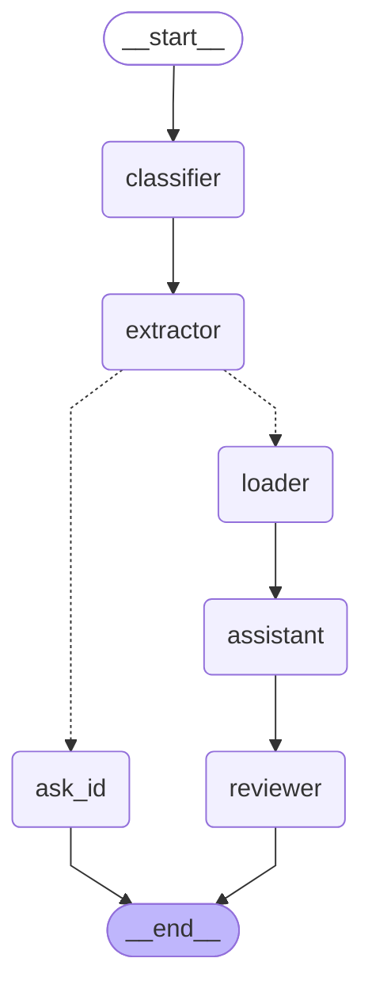

# FIAP Tech Challenge - Fase 3

Este repositório contém o projeto desenvolvido para a `Fase 3` do curso de Pós-Graduação em IA. O foco desta etapa é um assistente virtual médico.

> [!NOTE]
> Os fluxos necessários para pré-processar os dados, treinar o modelo, etc. estão acessíveis através da `cli` exposta pelo arquivo `main`.
> É possível acessar todas as opções através de `uv run python main.py --help`

## Pre Processing

O fluxo de pre-processamento consiste em carregarmos dois `datasets` (`PubMedQA` e `MedQuAD`) e [dados sintéticos](/data/protocols/hospital_protocols.json) representados protocolos hospitalares.

Esse processo "combina" os dados em um arquivo `JSONL` que será usado posteriormente.

Esse fluxo é disparado através da `cli` com o comando abaixo:

```bash
uv run python main.py --preprocess
```

### Token Hugging Face

Dados e modelos usados nesta etapa, demandam acesso a plataforma `Hugging Face`, mesmo o acesso sendo aberto, recomenda-se configurar um token de leitura:

1. Crie um token em [Hugging Face → Settings → Access Tokens](https://huggingface.co/settings/tokens).
2. Configure no ambiente ou em `.env` na pasta `fase_3`:

```bash
export HF_TOKEN="seu_token_aqui"
# ou crie fase_3/.env com: HF_TOKEN=seu_token_aqui
```

O `main.py` já define `HF_TOKEN` a partir de `config.settings` (e de variáveis de ambiente).

## Fine-tuning de LLM (QLoRA + LoRA)

O detalhamento dessa etapa, pode ser visto em maior profundidade aqui[analise_fine_tuning.md].

## Agente

Com o modelo ajustado pela etapa de `fine tuning` e os dados (como protocolos, etc) também já prontos, é possível criarmos o agente.

Nesta etapa, criamos as bases vetorial e relacional (usando `FAISS` e `SQLite` respectivamente)

> [!NOTE]
> A base vetorial é construída a partir de [documentos](data/protocols/) em PDF

> [!NOTE]
> A base relacional, representa o produto de uma extração (ETL) onde os dados são removidos e/ou anonimizados


Quando o agente é carregado e acionado, temos uma cadeia de ações (`chain`) que identifica o paciente em questão, carrega os dados do mesmo, recupera informações dos protocolos e finalmente formata uma resposta amigável (usando `LLM`) que o profissional pode usar **como suporte**.

```bash
uv run python main.py --agent
```

Abaixo, o diagrama com o fluxo executado pelo agente:



## Execução

Com todas as etapas completas, é possível acessarmos o agente através de uma interface (web) via `Streamlit`.

```bash
cd fase_3
uv run streamlit run ui.py
```

O comando acima, irá iniciar o servidor e abrir o navegador na interface que simula um chat com o agente, onde é possível fazer perguntas como:

> Qual o estado de saúde do paciente 123?

> [!TIP]
> Os identificadores dos pacientes são `123`, `456` e `789`


## Extra

É possível treinarmos o modelo diretamente pelos script:

```bash
python trainning/train_llm.py --data data/dataset_medico_treinamento.jsonl --output-dir output_llm --epochs 3
```

Parâmetros úteis do `train_llm.py`:

- `--model`: modelo HuggingFace (default: valor em `config.settings`, ex. `TinyLlama/TinyLlama-1.1B-Chat-v1.0`).
- `--data`: caminho do JSONL.
- `--output-dir`: diretório de checkpoints e adaptador final.
- `--max-length`: comprimento máximo em tokens (default: 512).
- `--max-samples`: limita amostras (útil para debug).
- `--batch-size`, `--grad-accum`, `--epochs`, `--lr`: hiperparâmetros de treino.
- `--flash-attn`: usa Flash Attention 2 (requer `flash-attn` instalado e GPU compatível).

### Inferência com o modelo fine-tunned

Após o fine-tuning, os adaptadores LoRA são salvos (por padrão) em algo como `fase_3/output_llm/adapter_final/` ou no diretório informado em `--output-dir`.

Para rodar uma inferência simples via script de exemplo:

```bash
cd fase_3

# Ajuste o caminho abaixo para o diretório de adaptadores que você treinou
sed -i '' 's|ADAPTER_DIR = "output_llm_r16_lr5e-6/adapter_final"|ADAPTER_DIR = "output_llm/adapter_final"|' infer_llm.py

python trainning/infer_llm.py

ou com uv:

uv run python trainning/infer_llm.py
```

O script `infer_llm.py`:

- Carrega o modelo base definido em `BASE_MODEL` (por padrão `TinyLlama/TinyLlama-1.1B-Chat-v1.0`).
- Carrega os adaptadores LoRA do diretório `ADAPTER_DIR`.
- Usa o template de prompt `### Instruction:\n{instruction}\n\n### Response:\n` para gerar a resposta.

Você pode editar diretamente, em `infer_llm.py`, os valores de:

- `BASE_MODEL`: caso queira trocar o modelo base da Hugging Face.
- `ADAPTER_DIR`: para apontar para outro treino (por exemplo `output_llm_r16_lr5e-6/adapter_final`).
- A variável `pergunta` no bloco `if __name__ == "__main__":` para testar diferentes instruções.

### GPU

O script usa `device_map="auto"` e `fp16` quando há CUDA. Para rodar em GPU:

```bash
# Verificar CUDA
python -c "import torch; print(torch.cuda.is_available())"
```

### Saída

- Checkpoints por época em `fase_3/output_llm/` (ou no `--output-dir` informado).
- Adaptadores LoRA finais em `fase_3/output_llm/adapter_final/` (apenas pesos LoRA, prontos para carregar com `PeftModel.from_pretrained(base_model, "fase_3/output_llm/adapter_final")`).
